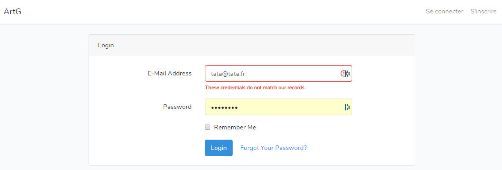
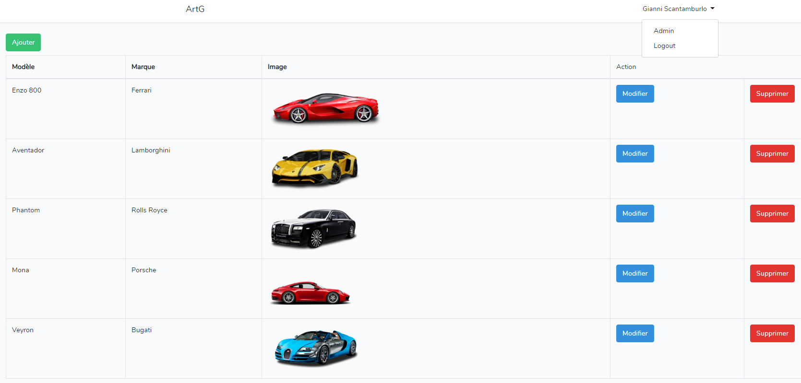
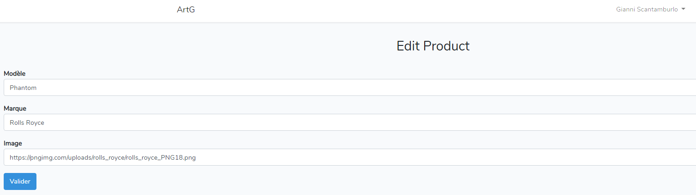

# ArtG Back


<p align="center">
<a style="justify-content: center" href="https://artgback.herokuapp.com/"></a>
</p>
<p align="center">
<a href="https://artgback.herokuapp.com/"></a>
<a href="https://artgback.herokuapp.com/"></a>
<a href="https://artgback.herokuapp.com/"></a>
</p>

ArtG is a cross-platform application which serves to rent luxury cars developed in 2020.

ArtG Back is the back-office of our school project, in which we had to develop a administration area for our application ArtG, where the administrators can manage cars, rentals, customers data etc. We also developed the API to transfer the data to the application. 

## Getting Started

These instructions will get you a copy of the project up and running on your local machine for development and testing purposes.

### Prerequisites

The ArtG Back website requires a server with PHP 7.2.5+.

The database engine that is used to store data for this application could be any of the engines supported by Laravel: MySQL, Postgres, SQLite and SQL Server.

You have to install Composer

Download Laravel using Composer:

```
composer global require laravel/installer
```

### Installing

First of all, Git Clone this project

cd into the directory of this project and run the following commands:
```
composer install
```
Configure the database settings in `app/config/database.php`
And migrate the database with:
```
php artisan migrate
php artisan db:seed
php artisan serve
```
This will install all Composer dependencies, create the database structure and populate the database with some sample data so that you could see this project in action.

You can access to the app by http://127.0.0.1:8000/ .

##API

Here are the routes to have the data from our API :

* POST http://localhost:8000/api/register
* POST http://localhost:8000/api/login
* GET http://localhost:8000/api/cars
* GET http://localhost:8000/api/cars/id (change id)
* POST http://localhost:8000/api/cars
* DELETE http://localhost:8000/api/cars/id (change id)
* PUT http://localhost:8000/api/cars/id (change id)

## Deployment

We used [Heroku](https://www.heroku.com/) to deploy our project.

## Demo

You can access to our web site to https://artgback.herokuapp.com/ .

## Pictures

#### Home Page

#### Login Page

#### Admin Page

#### Edit Page


## Built With

* [Laravel](https://laravel.com/) - The PHP framework used


## Official Documentation

Documentation for the entire framework can be found on the [Laravel website](http://laravel.com/docs).

## Versioning

We use [GitKraken](https://www.gitkraken.com/b) and [Git](https://git-scm.com/) for versioning.

## Progress

The project is not completed yet, because we had 4 months to do and some features are not implemented.

We have to add an access to manage the customers the rentals because now we just can add or modify the cars.

We could also improve the style of the administration space.

## Authors

| <a href="https://github.com/XDayonline" target="_blank">**Gianni Scantamburlo**</a> | <a href="https://github.com/Voltzy9" target="_blank">**Arthur Genthial**</a> |
| :---: |:---:|
| [](https://github.com/XDayonline)    |[](https://github.com/Voltzy9) | [](http://fvcproductions.com)  |
| <a href="http://github.com/fvcproductions" target="_blank">`https://github.com/XDayonline`</a> | <a href="http://github.com/fvcproductions" target="_blank">`https://github.com/Voltzy9`</a> 

## License

[](http://badges.mit-license.org)

- **[MIT license](http://opensource.org/licenses/mit-license.php)**
- Copyright 2020 © ArtG
